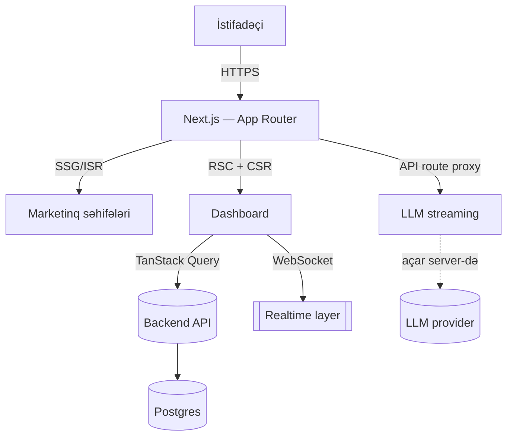

# Frontend Architect — Part 12: Stack Seçimi & Capstone

> Bu, "Frontend Architect" seriyasının **yekun** hissəsidir (bax:
> `courses/frontend-architect.plan.md`). Part 1–11-də düşüncə çərçivəsi,
> pattern-lər, rendering, performans və data-layer-i ayrı-ayrı gördük. Burada
> iki iş görürük: (1) **modern React 2026 stack**-ını (build tool, framework,
> routing, state, testing, React 19) qərar çərçivəsi ilə seçmək; (2) bütün kursu
> **bir capstone system-design** məşqində birləşdirmək. Bu part yeni "sintaksis"
> öyrətmir — Part 1-dəki qərar əzələsini bütöv bir tətbiqə tətbiq edir. Mənbə:
> patterns.dev / PatternsDev/skills (`react-2026`) + bütün əvvəlki part-lar.

---

## 1. Stack seçimi = qərar çərçivəsi, moda yox

### 1.1 Niyə vacibdir

Stack seçimi frontend architect-in ən görünən, ən çox mübahisə edilən qərarıdır —
və ən çox **moda** ilə verilən qərardır ("hamı X işlədir"). Part 1-in bütün
mənası budur: seçim **constraint-dən** çıxır, Twitter trend-indən yox. Bu
bölmədəki hər alət üçün sual eynidir: *bu komanda, bu tələb, bu constraint üçün?*

---

## 2. Build tool

- **Vite** — framework-siz layihələr üçün **defolt tövsiyə**; ESBuild dev
  (instant start), Rollup production.
- **Turbopack** — Vercel-in Rust bundler-i; Next.js daxilində inkremental
  kompilyasiya, ultra-sürətli reload.
- **Webpack** — əsasən **legacy** layihələr üçün qalır.
- **Rspack / RSBuild** — Rust-powered, Webpack ekosistem uyğunluğu + yüksək
  performans.

**Qərar:** yeni SPA/dashboard → Vite. Next.js işlədirsənsə → Turbopack (built-in).
Mövcud Webpack layihə → miqrasiya yalnız ölçülmüş fayda varsa (Part 1 "boring,
proven"; miqrasiya risk daşıyır).

---

## 3. Framework — starting point

- **Next.js** — production React app-lər üçün "go-to"; file-based routing, SSR,
  SSG, image optimization, API route, **RSC** (Part 8).
- **Remix** — web fundamentals və progressive enhancement vurğusu; inteqrasiya
  olunmuş routing, data loading, mutation.
- **Custom Vite setup** — SSR lazım olmayan SPA, dashboard, daxili alət.

**Qərar (Part 7 rendering ilə birləşir):**
- İctimai, SEO/SSR lazım → **Next.js**.
- Progressive enhancement fokusu → **Remix**.
- Daxili SPA/dashboard, SEO əhəmiyyətsiz → **Vite + routing lib**.

> **Niyə vacibdir:** Framework seçimi əslində **rendering strategiyası seçimidir**
> (Part 7–8). "Next.js, yoxsa Vite?" sualının cavabı "SSR/SEO lazımdırmı?"
> sualında gizlidir.

---

## 4. Routing

- **React Router** (v6.4+) — async data + suspense; battle-tested, etibarlı.
- **TanStack Router** — first-class TypeScript, built-in data loader + caching,
  zəngin search param idarəsi; "Remix/Next router-in gücü, amma decoupled".

**Qərar:** mövcud/geniş ekosistem, sadəlik → React Router. TS-heavy, tip-təhlükəsiz
route + search param, güclü data loader → TanStack Router.

---

## 5. State & data fetching (Part 3, 11 ilə birləşir)

- **TanStack Query** — **server state** lideri (`useQuery`/`useMutation`); Part
  11-in mərkəzi.
- **Zustand** — minimal, hook-əsaslı qlobal **client state**, sıfır boilerplate.
- **Redux Toolkit** — yalnız çox mürəkkəb state keçidləri, undo/redo, devtools
  tələbi.
- **React Hook Form + Zod** — deklarativ form validation.

**Qərar (Part 11 ayrımı):** server state → **TanStack Query** (həmişə). Client
state kiçik → **Zustand**/Context; çox mürəkkəb → Redux Toolkit. Form → RHF + Zod.

---

## 6. Testing

- **Vitest** — Vite layihələrinin təbii yoldaşı; Vite konfiqini paylaşır,
  Jest-uyğun API, instant watch.

**Qərar:** Vite/Vitest cütü defolt; komponent testi üçün Testing Library, E2E
üçün Playwright/Cypress (stack-dən asılı olmayaraq).

---

## 7. React 19 xüsusiyyətləri (əvvəlki part-lara bağ)

- **`ref` as prop** — `forwardRef` lazım deyil (Part 5, bölmə 9).
- **`use()` API** — promise/context şərti oxuma.
- **Actions** — server/client action ilə sadələşmiş form idarəsi.
- **`useOptimistic`** — async əməliyyatda dərhal UI feedback (Part 11 optimistic
  update-in native forması).
- **React Compiler** — komponentləri **avtomatik memoize** edir, manual
  `useMemo`/`useCallback`-i aradan qaldırır (Part 10, bölmə 4).

> **Niyə vacibdir:** React 19 bu kursda öyrəndiyin bir çox manual pattern-i
> (forwardRef, optimistic, memoization) dilin/compiler-in özünə köçürür. Architect
> qərarı: yeni layihədə bunları aç, manual həllərə yalnız compiler/API çatmayan
> yerdə uzan.

---

## 8. React + AI

AI alətlərini boilerplate generasiyası, komponent şablonu, test scaffolding üçün
işlət — amma expert-səviyyə **code review və validation**-ı bütün proses boyu
saxla. (Part 11 AI-UI: streaming, açar serverdə.)

> **Architect qeydi:** AI kod yazmağı sürətləndirir, qərar verməyi yox. Bu kursun
> bütün dəyəri — Problem→Options→Trade-offs→Decision — məhz AI-ın *sənin əvəzinə*
> edə bilmədiyidir. Kodu AI yazır; arxitekturanı sən.

---

## 9. Capstone — bütün kursu bir sistemə tətbiq et

### 9.1 Ssenari

**Tələb:** orta-ölçülü SaaS analytics platforması —
- İctimai marketinq saytı (SEO kritik).
- Login-dən sonra real-time dashboard (qraflar, böyük cədvəllər).
- Komanda üçün paylaşılan hesabatlar (server data, dəyişir).
- AI "insight izah et" xüsusiyyəti (LLM stream).

### 9.2 Qərar çərçivəsi ilə addım-addım (Part 1)

**Constraint-lər (əvvəl bunlar):** kiçik komanda (5 nəfər, React tanıyır), SEO
yalnız marketinqdə, dashboard yüksək interaktiv + real-time, deadline 3 ay.

**1. Rendering (Part 7–8):**
- Marketinq → **SSG/ISR** (SEO, sürət).
- Dashboard → **CSR** (SEO əhəmiyyətsiz, yüksək interaktiv).
- Hesabat səhifəsi → **SSR/RSC** (server data + paylaşıla bilən URL).
→ **Next.js** (per-route qarışıq mümkün, RSC + App Router).

**2. Kompozisiya (Part 4–5):** komponent kitabxanası — **headless + compound**
(Radix/shadcn üslubu); boolean-prop yox, composition.

**3. State/data (Part 11):** server state → **TanStack Query**; client state (tema,
filtr paneli) → **Zustand/Context**; form → RHF + Zod.

**4. Performans (Part 9–10):**
- Böyük cədvəl → **virtual list** + `content-visibility`.
- Route-based code splitting, barrel import qaç, Brotli.
- Yazı laggy olarsa → `startTransition` + memoized subtree.
- React 19 **Compiler** aç.

**5. Real-time:** dashboard push → TanStack Query + WebSocket subscription.

**6. AI insight (Part 11):** streaming, **API açarı Next.js route-da** (client-də
yox), thinking indikator.

**7. Sistem checklist (Part 1, bölmə 3):**
- **Failure:** API sönəndə skeleton + stale-while-revalidate + retry.
- **Security:** auth hər boundary-də, açar server-də, input validation (Zod).
- **Observability:** Web Vitals monitoring, error boundary + logging.
- **Cost:** ISR revalidation tezliyi, WebSocket bağlantı sayı.

**8. ADR-lər:** hər böyük qərar (Next.js, TanStack Query, Zustand vs Redux) bir
ADR faylı — Problem→Options→Trade-offs→Decision→Revisit.

### 9.3 Mermaid — komponent diaqramı

---

## 10. Yekun — frontend architect-in düşüncə xülasəsi

Bu kursun 12 hissəsi bir cümləyə yığılır: **"Frontend architect problemi
constraint kimi görür, 2-3 realistik variant qoyur, trade-off-ları açıq deyir,
bir constraint-ə görə qərar verir və nə vaxt yenidən baxacağını yazır."**

- Pattern-lər (Part 2–6) sənin **lüğətin**dir — problemi adlandırmağa imkan verir.
- Rendering (Part 7–8) və performans (Part 9–10) **fiziki qanunlar**dır — HTML
  harada qurulur, JS nə qədər gedir.
- Data (Part 11) həqiqətin mənbəyi ilə kopyası arasındakı **müqavilə**dir.
- Stack (Part 12) bunların hamısının **nəticəsi**dir, başlanğıcı yox.

Ən vacib bir cümlə (Part 1-dən): **"Belə hiss etdim" qərar deyil; "bu constraint
bunu məcbur etdi" qərardır.**

---

## Məşq — final capstone

Öz real (və ya təsəvvür etdiyin) layihən üçün tam bir arxitektura sənədi yaz:

1. **Constraint-lər** — komanda, SEO, interaktivlik, real-time, deadline, büdcə.
2. **Rendering** strategiyası (per-route; Part 7–8).
3. **Stack** seçimi (build/framework/routing/state/testing) — hər biri bir ADR.
4. **Performans** planı (Part 9–10) + performance budget rəqəmləri.
5. **Data-layer** (server vs client state; Part 11).
6. **System-design checklist** (Part 1) doqquz oxdan keç.
7. **Mermaid komponent diaqramı** + 3-5 ADR + risklər.

Bu sənəd sənin frontend architect kimi "portfolio parçan"dır — kod yox, **qərar
və onların müdafiəsi**.

---

## Xülasə

- Stack seçimi **constraint-dən** çıxır, modadan yox (Part 1).
- **Build:** Vite (defolt), Turbopack (Next.js), Webpack (legacy).
- **Framework:** Next.js (SSR/SEO), Remix (progressive), Vite (SPA) — əslində
  rendering qərarı (Part 7–8).
- **Routing:** React Router (battle-tested) vs TanStack Router (TS-first).
- **State:** TanStack Query (server), Zustand/Context (client), Redux (mürəkkəb);
  RHF+Zod (form).
- **React 19:** ref-as-prop, `use()`, Actions, `useOptimistic`, **Compiler** —
  manual pattern-ləri dilə köçürür.
- **AI:** kod yazmağı sürətləndirir, **qərar verməyi yox** — arxitektura sənin.
- Capstone: hər şeyi bir system-design sənədində (constraint → rendering → stack
  → performans → data → checklist → ADR → diaqram) birləşdir.

---

## Mənbələr

- [PatternsDev/skills — react-2026](https://github.com/PatternsDev/skills/tree/main/react/react-2026)
- [React 19 buraxılış qeydləri](https://react.dev/blog/2024/12/05/react-19),
  [Next.js](https://nextjs.org/), [TanStack](https://tanstack.com/),
  [Vite](https://vitejs.dev/), [Vitest](https://vitest.dev/)
- **Seriya tamamlandı.** Bütün 12 hissə: `courses/frontend-architect.plan.md`
  (məzmun) + `frontend-architect-part1.md` … `-part12.md`.
